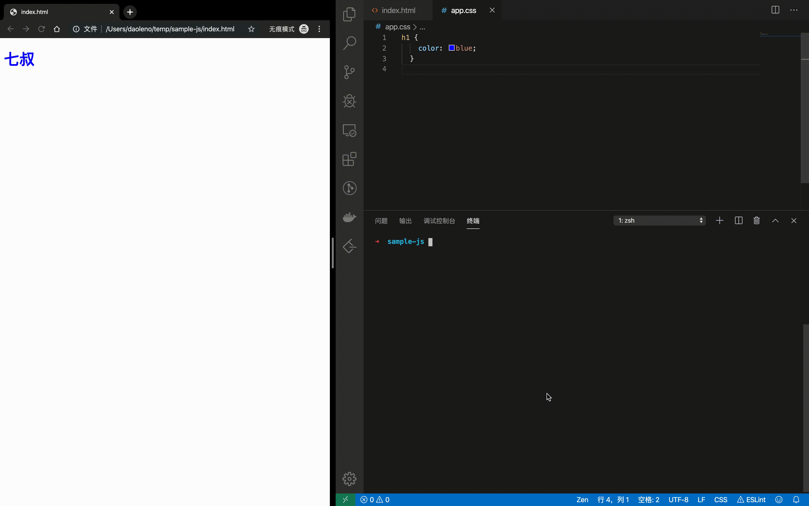
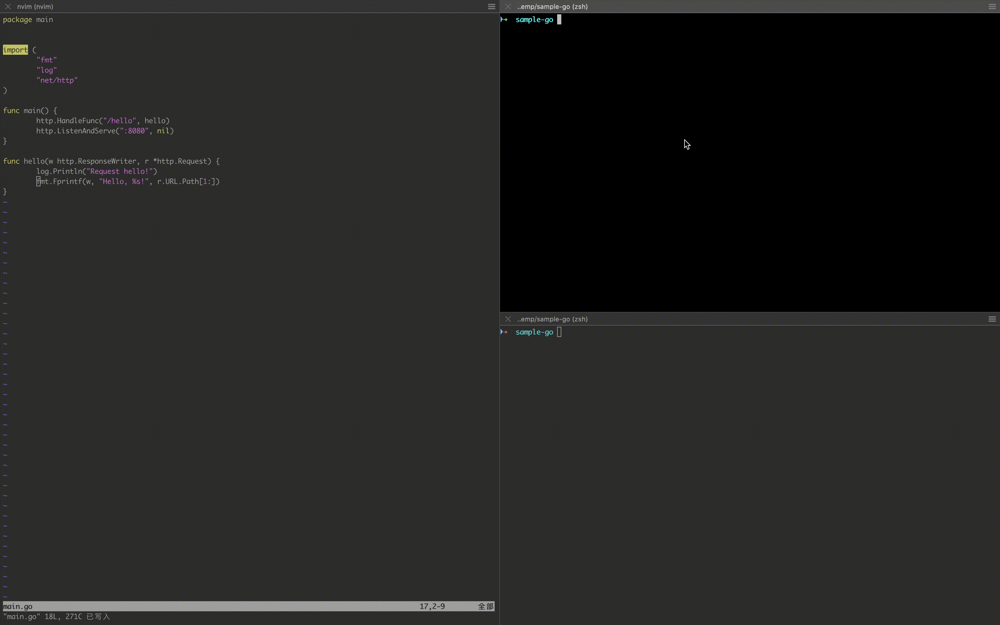

I recently watched Bret Victor's video - Inventing on Principle. That is so inspired. The demos are awesome in their own right. He talked about his principle: **Creators need an immediate connection to what they create.**
https://youtu.be/PUv66718DII

Inspired by that, I start thinking about how to speed up my development feedback. Here is a little trick that I think is useful to me.

## Introduce two core tools

[ag](https://github.com/ggreer/the_silver_searcher): The Silver Searcher. Like ack, but faster.
[entr](http://eradman.com/entrproject/): Run arbitrary commands when files change.

## Save code, See the result

### Web sample

When any html/css/js files change, the current chrome page will refresh.

```zsh
ag -l --html --css --js | entr ./reload-browser.sh chrome
```

You can download `reload-browser.sh` from [here](https://gist.github.com/daoleno/4e155bb65c433d490b3a70e5a96377c0).



### Golang sample

When any go files change, my custom run script will be executed. I can build, start, run tests on my project automatically.

```zsh
ag -l --go | entr -c -r ./run.sh
```


